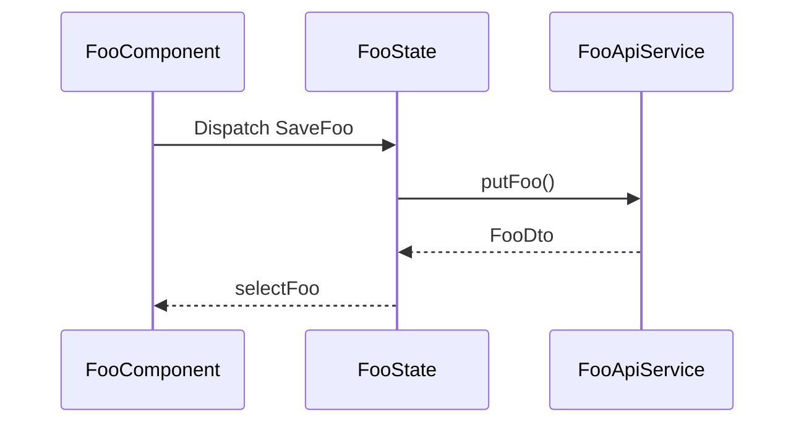

# Architect First Gate — Design Template & Examples

## Chat output template

Use this structure in the design turn (omit empty optional parts when the change is tiny).

### Goal

What changes and why (1–3 sentences).

### Participants

| Name | Kind | Role in this change |
|------|------|---------------------|
| `FooComponent` | component | ... |
| `FooState` | NGXS | ... |
| `FooApiService` | service | ... |

### Current flow

Short prose, or `N/A — greenfield`. Then a mermaid diagram with **real** repo names:

### Proposed flow

Short prose: what changes vs current. Then mermaid:

### Communication mechanisms

| Boundary | Mechanism | Direction | Why this mechanism |
|----------|-----------|-----------|--------------------|
| Parent → Child | `@Input()` / signal input | down | presentational child |
| Child → Parent | `output()` | up | local UI event only |
| UI ↔ domain state | NGXS action / select | bi | shared or routed state |
| UI ↔ API | service via store/facade | out | keep HTTP out of templates |
| Cross-feature | existing facade / events | ... | match module convention |

### Impact / risks

- Files likely touched: ...
- Contracts: API / i18n / routes ...
- Watch for: ...

### Open questions / assumptions

- Assumption: ...
- Question (blocking): ...

### Gate closing line

End every design turn with:

> 以上是宏觀組件溝通設計。請確認或指出要調整的地方；**你同意後我才開始寫程式。**

## Mechanism cheat sheet (Angular / NGXS projects)

Prefer **existing** module patterns. Typical choices:

| Need | Prefer | Avoid (unless justified) |
|------|--------|---------------------------|
| Parent configures child | Input / signal input | Store round-trip for local UI only |
| Child notifies parent | `output()` | Service singleton as event bus for one parent-child pair |
| Shared feature state / multi-view | NGXS (actions + selectors) | Duplicating the same fetch in each component |
| HTTP | API service called from store/effect/facade | Raw `HttpClient` in presentational components |
| Cross-feature soft coupling | Existing facade / documented events | New global Subject unless project already uses that pattern |

## Example A — Small bug (still gate)

**User:** Fix the save button not refreshing the list after create.

**Design (condensed):**

- **Goal:** After successful create, list should show the new item without full page reload.
- **Participants:** `OrderListComponent`, `OrderFormComponent`, `OrderState`, `OrderApiService`
- **Current:** Form dispatches `CreateOrder` → API succeeds → form closes; list still holds old `selectOrders` snapshot.
- **Proposed:** On `CreateOrder` success, store either prepends entity or dispatches `LoadOrders`; list keeps `async` select — no new Input/Output.
- **Mechanism:** NGXS only; form ↔ list via store, not parent bridge.
- **Gate ask:** wait for approval before coding.

## Example B — Feature with new boundary

**User:** Add a detail drawer opened from the table row.

- Map **Current** list-only flow.
- **Proposed:** `OrderTableComponent` emits `rowSelected` → container sets selected id → `OrderDetailDrawerComponent` receives id Input and loads via existing `OrderState` select/dispatch.
- Call out why drawer is presentational (Input + select) vs owning HTTP.
- List Impact: container template, table outputs, drawer component, possibly route query param — then gate.

## Approval phrases (examples)

| User says | Treat as |
|-----------|----------|
| 同意 / OK / 可以 / 照這個做 / 開始實作 / LGTM | Approval → implement |
| 改成用 Output 不要 NGXS | Not approval → revise design, re-gate |
| 為什麼不用 service？ | Question → answer, keep gate closed |
| 可以，順便也改一下 typography | Partial → confirm whether typography is in scope; if new communication, update design first |
