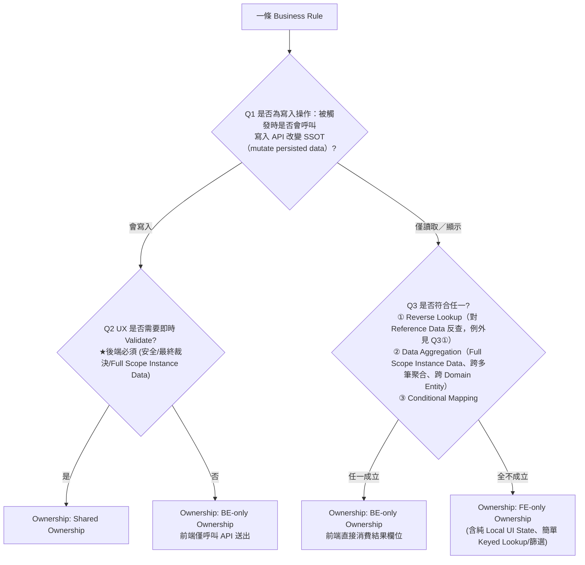

# Business Rule Ownership Guideline

跨功能模組通用架構指南：審查、撰寫與判定各類 **Business Rule** 應由前端、後端或前後端共同實作（FE-only / BE-only / Shared Ownership）。

> 本指南借用部分 DDD 風格名詞（Domain Entity、Entity State），核心目的是規範 **Business Rule 的前後端 Ownership 判定**，**不是** Domain-Driven Design 實作指南。

## 使用前提

1. **進入決策樹前須符合 SRP**（見下方「Business Rule 的定義」）。若同一條又前端又後端，代表混寫，須拆開後個別跑決策樹。
2. **Rule Type 與 Ownership 分開回答**：Rule Type 是撰寫階段的拆條輔助標籤；Ownership 由決策樹產出。兩者不可互相取代。
3. **判斷原則：從需求層面出發**，不受現有實作架構（現在 API 回傳什麼欄位）影響。
4. **dry-run 附屬於 Write Action 條目**：不獨立成條、不單獨跑決策樹；不因 dry-run 不改 SSOT 而誤判 Q1=否。

## Business Rule 的定義

一條 **Business Rule** 是審查與判定 Ownership 的最小單位，應滿足：

1. **具業務語意**：RD／PM 能讀懂「這條規則在產品上做什麼」。
2. **單一職責（SRP）**：只描述一種職責（提供資料、顯示／推算、純 UI、或寫入 action），不混寫。
3. **可獨立判定 Ownership**：能單獨跑決策樹得出 FE-only / BE-only / Shared。
4. **找得到落點**：能指出對應哪個畫面、哪支 API、或哪段 code。

完整名詞解釋見 [reference.md](reference.md#名詞解釋)。

## Rule Type（撰寫階段的拆條輔助標籤）

用於檢查 SRP；**不取代 Ownership 決策樹**。

| Rule Type | 定義 | Ownership 傾向 |
|---|---|---|
| Presentation Formatting | 將已算定的 literal 轉成可讀文案／格式；不重新推算 Entity State、不改 SSOT | 幾乎必為 FE-only |
| Local UI State | 純前端互動，離開畫面即失效；不影響 database／web-be | 必為 FE-only |
| Display / Calculation | 顯示／推算／條件判斷（含按鈕可否點）；不呼叫寫入 API、不改 SSOT | 需完整跑 Q3 |
| Write Action | 觸發時呼叫寫入 API，改變 SSOT；後端必須實作 | 需另跑 Q2（Shared 或 BE-only） |

常見歧義與 Examples 見 [reference.md](reference.md#rule-type-細節)。

## Ownership 決策樹



**唯一**通往 Shared Ownership 的路徑是 Q1→Q2。判定為 Shared 時，兩側職責**不可互換**（見 [reference.md](reference.md#responsibility-matrixraci)）。

### Q1 — 是否為寫入操作？

以「**有沒有呼叫寫入 API**」為準；顯示／推算／按鈕可否點等不呼叫寫入 API 者 → 否。

- **是** → 後端永遠必須實作 → 進 Q2。
- **否** → 進 Q3。

### Q2 — UX 是否需要即時 Validate？

操作當下是否需要即時 Validate（格式、必填、衝突預檢、已載入資料比對、dry-run 預覽等）？

- 有前置輸入需回饋（含寫入表單）→ **是** → **Shared Ownership**。
- 僅「按下即送 API、無預驗證」（如列上 Delete／Reboot）→ **否** → **BE-only**（前端僅呼叫 API 送出）。

### Q3 — 顯示／推算類規則的 Ownership

符合以下**任一**即 **BE-only**（前端直接消費後端算好的結果欄位）：

1. **Reverse Lookup**（Reference Data 反查；有限 FE-only 例外）
2. **Data Aggregation**（Full Scope Instance Data、跨多筆聚合、跨 Domain Entity）
3. **Conditional Mapping**（須查 Mapping Table 才能唯一解讀欄位以得出 Entity State）

**全不成立 → FE-only**：Local UI State、僅對使用者當下互動／已載入資料做 lookup／篩選／勾選統計、**Consume** 後端已下發的 Entity Attribute，或 Reference Data **Keyed Lookup**。

Q3①②③ 的完整判準、例外條件、Examples，以及 FE／BE／Shared Pros／Cons，**只**見 [reference.md](reference.md#q3-詳細判準與-examples)——判定有歧義或需舉例時再讀，勿在此重述細節。

## Business Rule 撰寫範本

```markdown
* [畫面／模組] 規則简述
  * Rule Type: Display / Calculation | Local UI State | Presentation Formatting | Write Action
  * Ownership: FE-only | BE-only | Shared
  * Ownership 判定方式: AI | 人工
  * 判定歸屬的理由:
    * Q1 是/否：…
    * Q2 是/否：…（僅 Q1=是 時）
    * Q3 ①②③ 或 全不成立：…（僅 Q1=否 時）
  * 範圍備註: 不含 …；現況技術債 …
```

必要欄位：標題、Rule Type、Ownership、判定方式、判定理由、範圍備註；Code／API 參照選填。欄位說明見 [reference.md](reference.md#撰寫一條-business-rule-的建議欄位)。

## 審查與推進流程

1. **選定範圍**：模組／畫面／user flow。
2. **從 code 或 spec 抽出候選規則**，先不判定 Ownership。
3. **拆成符合 SRP 的條目**：旗標判定與呈現分開；計算與篩選分開。
4. **標註 Rule Type**（四選一）與**跑決策樹**得出 Ownership。
5. **記錄現況 vs 目標**：若 code 與決策樹結論不符，標為技術債並註明期望 API／欄位。
6. **與 BE 對齊**：優先處理 Q3①②③ 與寫入路徑不一致項；分期收斂前端過度實作。

## Additional resources

- 名詞解釋、Rule Type 細節、Ownership Pros／Cons／Examples、Responsibility Matrix、Q3 完整判準：[reference.md](reference.md)
