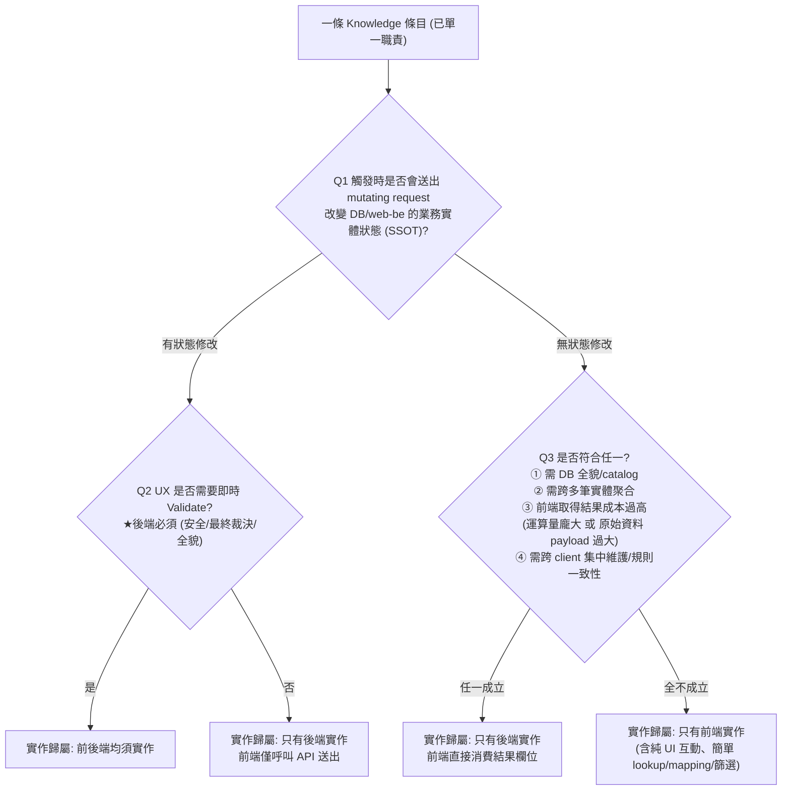

# Knowledge 條目與前後端實作歸屬指南

用於盤點、撰寫與判定各類 **Knowledge 條目**（商業規則、狀態推算、權限裁決等）應由前端、後端或前後端共同實作，避免前端 hard-code 需要全貌的 domain knowledge，或前後端規則不一致造成 bug。

## 使用前提

1. **先確保單一職責**：一條 knowledge 只能是「資料提供 / UI 互動 / 寫入 action」其中一種，不可混寫。若覺得同一條又前端又後端，代表混寫，須拆開後個別跑決策樹。
2. **屬性與實作歸屬分開回答**：屬性（下表）描述「這條規則做什麼」；實作歸屬（決策樹）回答「誰該做」。兩者須分開填寫，不可互相取代。
3. 判斷原則：**從需求層面出發**，不受現有實作架構（現在 API 回傳什麼欄位）影響。

## Knowledge 屬性（四選一）

| 屬性 | 定義 | 判準 |
|---|---|---|
| Wording 顯示 | 將後端已算定的 literal 值轉成可讀文案／格式 | 不重新推算業務狀態、不改 SSOT |
| UI 操作 | 純前端互動，離開畫面即失效 | 不影響 database／web-be 任何狀態 |
| 狀態顯示 | 顯示／推算／條件判斷（含按鈕可否點、旗標消費） | 不送出 mutating request、不改 SSOT；SSOT 未變時每次結果應相同 |
| 狀態遷移與轉換 | 觸發時送出 mutating request | 直接或間接改變業務實體 SSOT；後端必須實作 |

常見歧義（如「先算數值 vs 再用數值篩選」「旗標判定 vs 旗標呈現」）與更多範例見 [reference.md](reference.md#knowledge-屬性常見歧義)。

## 實作歸屬決策樹



**唯一**通往「前後端均須實作」的路徑是 Q1→Q2。判定為「前後端均須實作」時，兩側職責**不可互換**（見 [reference.md](reference.md#守備範圍對照)）。

### Q1 — 會不會改變 SSOT？

用「**有沒有送出 mutating request**」當客觀判準，避免把「顯示一個由狀態算出來的值／旗標／數量」誤判為改狀態。

- **是** → 後端永遠必須實作（安全：不可信任前端；後端握有全貌做最終裁決與寫入）→ 進 Q2。
- **否** → 進 Q3。

> 「按鈕能不能點／顯示一個數量或旗標」本身不會改狀態，走 Q3；只有「按下去送出的 mutating request」才走 Q1=是。

### Q2 — UX 是否需要即時 Validate？

使用者操作當下，UX 是否需要即時 Validate（格式、明顯衝突、已載入資料比對、dry-run 預覽等）以減少 round-trip？

- **是** → **前後端均須實作**（前端即時 Validate／dry-run，後端最終驗證與寫入）。
- **否** → **只有後端實作**（前端只呼叫 API 送出 action，無預驗證 UI）。

### Q3 — 非寫入路徑的前後端分流

純顯示、條件判斷、數值計算或純 UI 互動，皆不改變 SSOT。符合以下**任一**即「只有後端實作」（前端直接消費結果欄位）：

1. 需要 **database 全貌／業務 catalog** 才能判斷；
2. 需要**跨多筆業務實體聚合**；
3. **前端自行取得結果的成本過高**——運算量龐大（browser 效能限制）或原始資料量龐大（下發會使 payload／網路 I/O 暴增，即使單筆計算很簡單）；
4. 需**跨 client（WEB／APP／API consumer）集中維護**同一套規則以確保一致性。

**以上全不成立** → **只有前端實作**：純 UI 互動（篩選／跳轉／展開／勾選），或所需輸入僅來自使用者當下互動、或與單一實體綁定的單筆／少量資料，且僅做簡單 lookup／mapping／篩選／勾選統計。

> 純顯示的「安全」考量不在 Q3；安全防線在寫入時由後端把關（Q1）。Q3④ 只談「集中維護／規則一致性」，不談「不可信前端」。

各判定分支的 Pros／Cons／完整 Examples 見 [reference.md](reference.md#code-level-實作-knowledge)。

## Knowledge 條目撰寫範本

```markdown
* [畫面／模組] 規則简述
  * 屬性: 狀態顯示 | UI 操作 | Wording 顯示 | 狀態遷移與轉換
  * 實作歸屬: 只有前端實作 | 只有後端實作 | 前後端均須實作
  * 實作歸屬判定: AI | 人工
  * 判定歸屬的理由:
    * Q1 是/否：…
    * Q2 是/否：…（僅 Q1=是 時）
    * Q3 ①②③④ 或 全不成立：…（僅 Q1=否 時）
  * 範圍備註: 不含 …；現況技術債 …
```

必要欄位：標題、屬性、實作歸屬、判定方式（AI／人工）、判定理由（對應 Q1/Q2/Q3）、範圍備註、Code／API 參照（選填）。

## 盤點與落地流程

1. **選定範圍**：模組／畫面／user flow。
2. **從 code 或 spec 抽出候選規則**，先不判定歸屬。
3. **拆成單一職責條目**：資料、UI、寫入分開；旗標判定與呈現分開；計算與篩選分開。
4. **標註屬性**（四選一）與**跑決策樹**得出實作歸屬。
5. **記錄現況 vs 目標**：若 code 與決策樹結論不符，標為技術債並註明期望 API／欄位。
6. **與 BE 對齊**：優先處理 Q3①②④ 與寫入路徑不一致項；分期收斂前端過度實作。

## Additional resources

- 完整名詞解釋、屬性常見歧義、FE-only／BE-only／前後端均須的 Pros／Cons／Examples、完整守備範圍對照表：[reference.md](reference.md)
