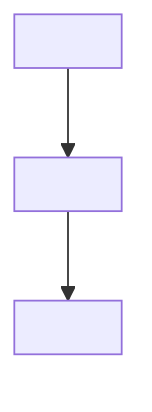
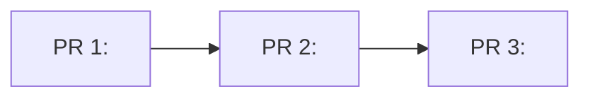
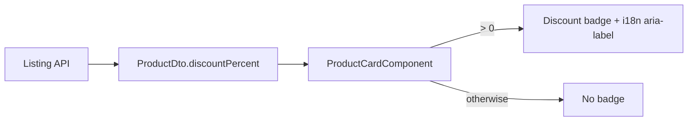
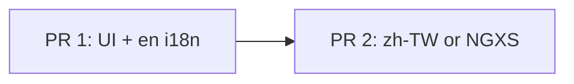

# Implementation Plan Template — Detailed Mode

Use for **詳盡模式** (ready to implement). Split work with **PR** only—never Phase.

**Reviewability (mandatory):** each PR targets **≤ 3 files** and **≤ ~200 lines** net diff. If larger, add another PR. Each Verification includes a **human checkpoint** before the next PR.

Copy and adapt when writing a plan. Replace placeholders; remove sections marked optional if not needed.

```markdown
# <Feature or requirement title>

## Requirement

### Summary
<What is being built and why, in one paragraph.>

### Goals
- <Measurable outcome 1>
- <Measurable outcome 2>

### Out of scope
- <Explicitly excluded item, or "None for this iteration.">

### Assumptions / dependencies
- <Prerequisite, external API, or team dependency, or "None.">

### Flow overview (recommended — use mermaid)

<One-line caption describing the diagram.>



## Implementation PRs

### PR overview (recommended — use mermaid when multiple PRs)

<One-line caption describing merge order and dependencies.>



### PR 1: <short title>

#### Scope
- <Deliverable and boundaries>
- <Files (≤3): `path/a`, `path/b`, `path/c`>
- <Estimated size: ≤~200 lines net diff>
- <Merge dependency: none / requires PR N merged and human-approved first>

#### Implementation
1. <Step with approach and key changes>
2. <Step referencing existing patterns or modules>
3. <Step>

#### Verification
- [ ] <Command, test, or manual check>
- [ ] <Observable outcome>
- [ ] Diff stays within ≤3 files and ≤~200 lines; CI green
- [ ] **Human checkpoint:** reviewer approves / merges before starting PR 2

### PR 2: <short title>

#### Scope
...

#### Implementation
1. ...

#### Verification
- [ ] ...
- [ ] **Human checkpoint:** reviewer approves / merges before starting PR 3 (or done)

<!-- Repeat PR N as needed; split further if a PR would exceed ≤3 files / ≤~200 lines -->

## Risks and mitigations (optional)

| Risk | Mitigation |
|------|------------|
| <risk> | <mitigation> |

## Open questions (optional)

- <Unresolved decision or stakeholder input needed>
```

## Minimal example (small change)

```markdown
# Add discount badge to product card

## Requirement

### Summary
Show an active discount percentage on the product card when a promotion applies, so shoppers see savings without opening the detail page.

### Goals
- Badge visible when `product.discountPercent > 0`
- No extra API call on the listing page

### Out of scope
- Cart-level coupons; checkout discount summary

### Assumptions / dependencies
- `ProductDto` already includes `discountPercent` from the listing API

### Flow overview

Data path from API to badge on the listing card:



## Implementation PRs

### PR overview

Stacked small PRs; each ≤3 files / ≤~200 lines; human approve between PRs:



### PR 1: UI and i18n

#### Scope
- Files (≤3): `product-card.component.html`, `_product-card.scss`, `apps/gui3/src/i18n/en.yaml`
- Estimated size: ≤~200 lines; `zh-TW.yaml` in PR 2 if adding both locales would exceed file limit
- Reuse existing `NgOptimizedImage`; no NGXS changes in this PR

#### Implementation
1. Add `@if (product.discountPercent > 0)` badge in template with `aria-label` from i18n
2. Add `product.card.discount-badge` key to `en.yaml`
3. Style badge per design tokens in `_product-card.scss`

#### Verification
- [ ] `npm run test -- product-card` passes
- [ ] Manual: listing page shows badge only for discounted products
- [ ] Diff ≤3 files / ≤~200 lines; CI green
- [ ] **Human checkpoint:** approve / merge before PR 2

### PR 2: zh-TW i18n (or NGXS if needed)

#### Scope
- Files (≤3): `apps/gui3/src/i18n/zh-TW.yaml` (and at most two related files if wiring needed)
- Requires PR 1 merged and approved; skip NGXS if DTO binding in PR 1 is sufficient

#### Implementation
1. Add matching `product.card.discount-badge` key to `zh-TW.yaml`
2. If DTO is insufficient: add selector in `product.state.ts` with null/0 edge cases (keep ≤3 files)

#### Verification
- [ ] Locale string present; unit tests for selector edge cases if added
- [ ] No duplicate API calls introduced
- [ ] **Human checkpoint:** approve / merge (or done)
```

## Mermaid quick reference

| Scenario | Diagram type | Example snippet |
|----------|--------------|-----------------|
| API / UI sequence | `sequenceDiagram` | `User->>Component: action` |
| Component data flow | `flowchart` | `A --> B` |
| NGXS / state transitions | `stateDiagram-v2` | `[*] --> Idle` |
| DB tables / relations | `erDiagram` | `USER ||--o{ ORDER : places` |
| PR merge order | `flowchart` | `R1[PR 1] --> R2[PR 2]` with `R2 -.depends on.-> R1` |

Prefer **mermaid** over ASCII art or bullet-only prose when the reader needs to grasp structure at a glance.
