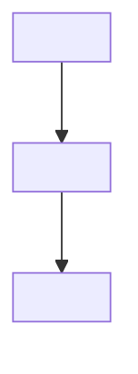
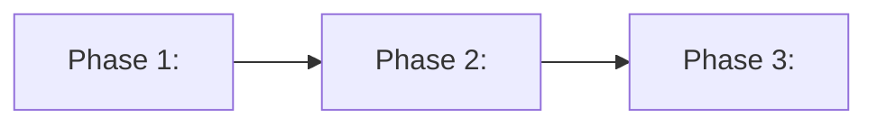
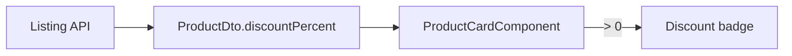

# Implementation Plan Template — Overview Mode

Use for **概覽模式**. Split work with **Phase** only—never PR.

Copy and adapt when writing a plan. Replace placeholders; remove optional sections if not needed.

```markdown
# <Feature or requirement title>

## Requirement

### Summary
<What is being built and why, in one paragraph.>

### Goals
- <Measurable outcome 1>
- <Measurable outcome 2>

### Out of scope (optional)
- <Explicitly excluded item, or omit section>

### Assumptions / dependencies (optional)
- <Prerequisite or "None.", or omit section>

### Flow overview (recommended — use mermaid)

<One-line caption describing the diagram.>



## Implementation Phases

### Phase overview (recommended when multiple Phases)

<One-line caption.>



### Phase 1: <short title>

#### Scope
- <Deliverable and boundaries>
- <Areas/modules involved>
- <Dependency on other Phases: none / requires Phase N>

#### Implementation
- <High-level approach—not step-by-step>
- <Key decision or pattern to follow>

#### Verification
- <Observable outcome or acceptance check>
- <Stakeholder sign-off or demo scenario if relevant>

### Phase 2: <short title>

#### Scope
...

#### Implementation
- ...

#### Verification
- ...

<!-- Repeat Phase N as needed; prefer 1–3 Phases -->

## Open questions (optional)

- <Unresolved decision or stakeholder input needed>
```

## Minimal example (small change)

```markdown
# Add discount badge to product card

## Requirement

### Summary
Show an active discount percentage on the product card when a promotion applies, so shoppers see savings without opening the detail page.

### Goals
- Badge visible when `product.discountPercent > 0`
- No extra API call on the listing page

### Out of scope
- Cart-level coupons; checkout discount summary

### Flow overview

Data path from API to badge on the listing card:



## Implementation Phases

### Phase 1: UI and presentation

#### Scope
- Product card template, styles, and i18n strings
- Listing page only; reuse existing `ProductDto` field

#### Implementation
- Conditional badge in card template with accessible label
- i18n keys under `product.card.*`
- Styles aligned with design tokens

#### Verification
- Badge appears only for discounted products on listing page
- No regression on non-discounted cards

### Phase 2: State layer (if needed)

#### Scope
- NGXS selector only if discount cannot be read from DTO directly
- Depends on Phase 1 UI approach

#### Implementation
- Evaluate after Phase 1; add selector only if derivation is required

#### Verification
- Edge cases covered (0%, null) if selector is added
```

## Mermaid quick reference

| Scenario | Diagram type | Example snippet |
|----------|--------------|-----------------|
| End-to-end flow | `flowchart` | `A --> B --> C` |
| Phase order | `flowchart` | `P1[Phase 1] --> P2[Phase 2]` |
| Actor sequence | `sequenceDiagram` | `User->>Component: action` |

Prefer **mermaid** over bullet-only prose when the reader needs structure at a glance.
