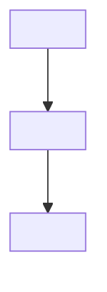
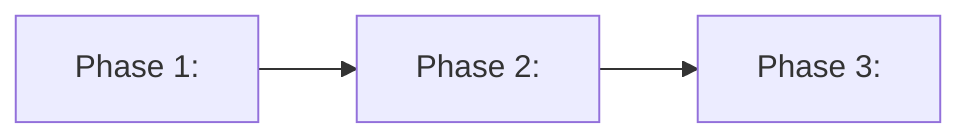
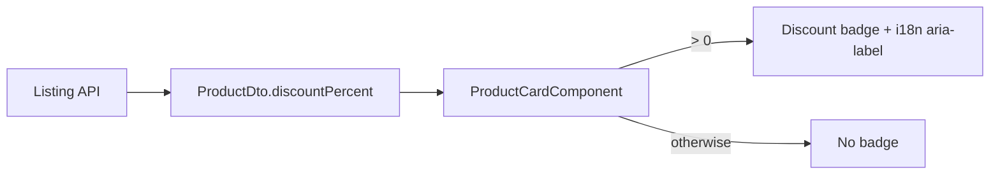

# Implementation Plan Template

Copy and adapt when writing a plan. Replace placeholders; remove sections marked optional if not needed.

```markdown
# <Feature or requirement title>

## Requirement

### Summary
<What is being built and why, in one paragraph.>

### Goals
- <Measurable outcome 1>
- <Measurable outcome 2>

### Out of scope
- <Explicitly excluded item, or "None for this iteration.">

### Assumptions / dependencies
- <Prerequisite, external API, or team dependency, or "None.">

### Flow overview (recommended — use mermaid)

<One-line caption describing the diagram.>



## Implementation Phases

### Phase overview (recommended — use mermaid when multiple phases)



### Phase 1: <short title>

#### Scope
- <Deliverable and boundaries>
- <Files or areas: `path/to/module`, `path/to/component`>
- <Dependency on other phases: none / requires Phase N>

#### Implementation
1. <Step with approach and key changes>
2. <Step referencing existing patterns or modules>
3. <Step>

#### Verification
- [ ] <Command, test, or manual check>
- [ ] <Observable outcome>

### Phase 2: <short title>

#### Scope
...

#### Implementation
...

#### Verification
...

<!-- Repeat Phase N as needed -->

## Risks and mitigations (optional)

| Risk | Mitigation |
|------|------------|
| <risk> | <mitigation> |

## Open questions (optional)

- <Unresolved decision or stakeholder input needed>
```

## Minimal example (small change)

```markdown
# Add discount badge to product card

## Requirement

### Summary
Show an active discount percentage on the product card when a promotion applies, so shoppers see savings without opening the detail page.

### Goals
- Badge visible when `product.discountPercent > 0`
- No extra API call on the listing page

### Out of scope
- Cart-level coupons; checkout discount summary

### Assumptions / dependencies
- `ProductDto` already includes `discountPercent` from the listing API

### Flow overview

Data path from API to badge on the listing card:



## Implementation Phases

### Phase 1: UI and i18n

#### Scope
- `product-card.component` template and styles only
- Reuse existing `NgOptimizedImage` and i18n YAML keys under `product.card.*`

#### Implementation
1. Add `@if (product.discountPercent > 0)` badge in template with `aria-label` from i18n
2. Add `product.card.discount-badge` key to `en.yaml` and `zh-TW.yaml`
3. Style badge per design tokens in `_product-card.scss`

#### Verification
- [ ] `npm run test -- product-card` passes
- [ ] Manual: listing page shows badge only for discounted products
- [ ] Screen reader announces discount via `aria-label`

### Phase 2: NGXS selector (if needed)

#### Scope
- Only if discount must be derived in state—not required if DTO field is sufficient

#### Implementation
1. Skip if Phase 1 uses DTO directly; otherwise add selector in `product.state.ts`

#### Verification
- [ ] Unit test for selector edge cases (0%, null)
```

## Mermaid quick reference

| Scenario | Diagram type | Example snippet |
|----------|--------------|-----------------|
| API / UI sequence | `sequenceDiagram` | `User->>Component: action` |
| Component data flow | `flowchart` | `A --> B` |
| NGXS / state transitions | `stateDiagram-v2` | `[*] --> Idle` |
| DB tables / relations | `erDiagram` | `USER ||--o{ ORDER : places` |
| Phase gating | `flowchart` | `P1 --> P2` with `P2 -.depends on.-> P1` |

Prefer **mermaid** over ASCII art or bullet-only prose when the reader needs to grasp structure at a glance.
